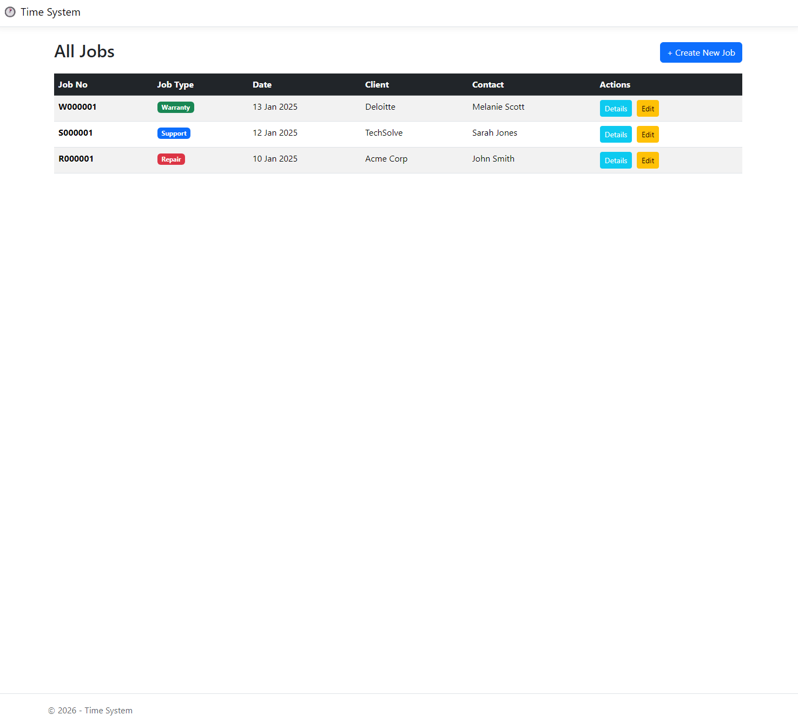
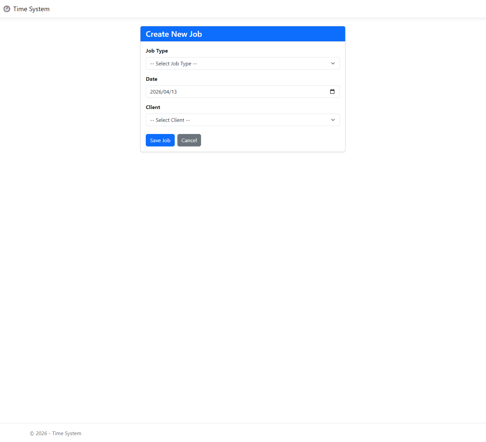
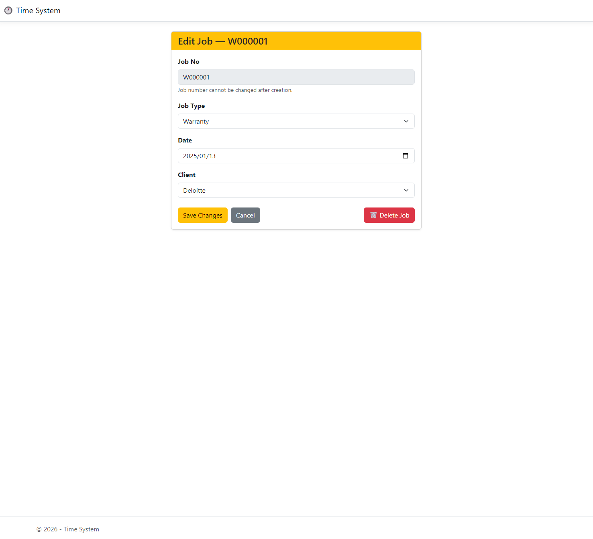
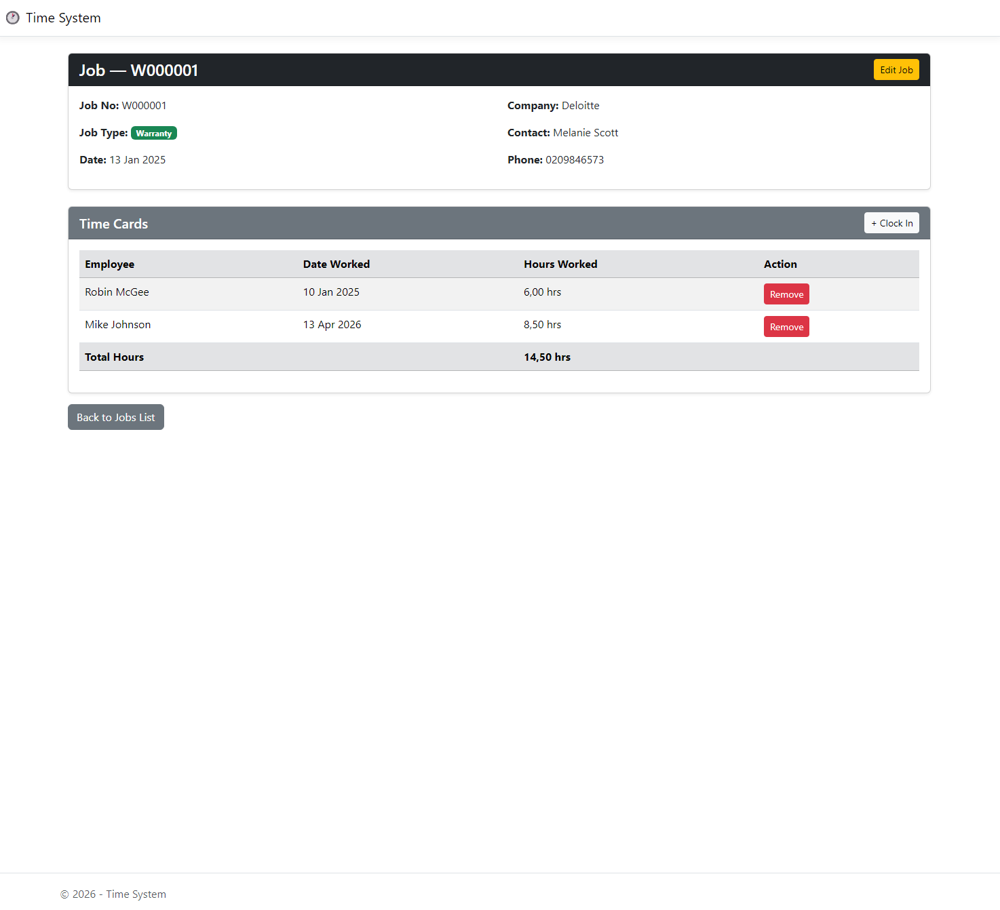
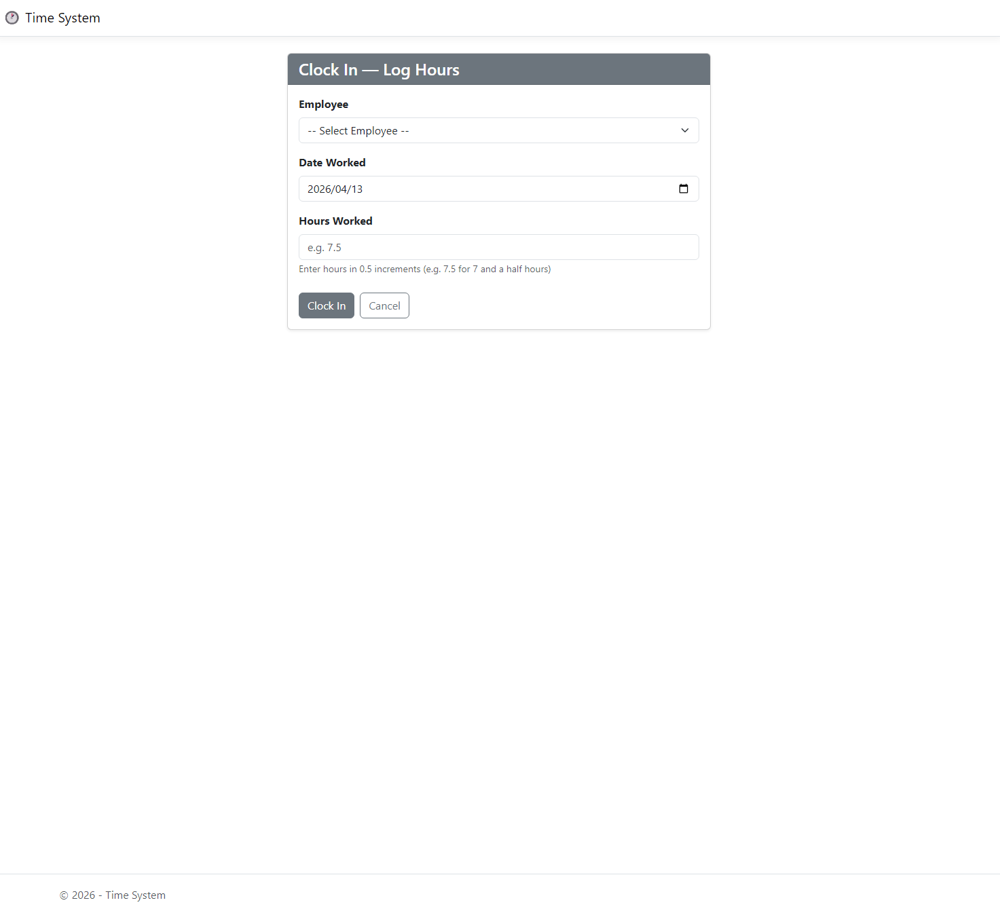
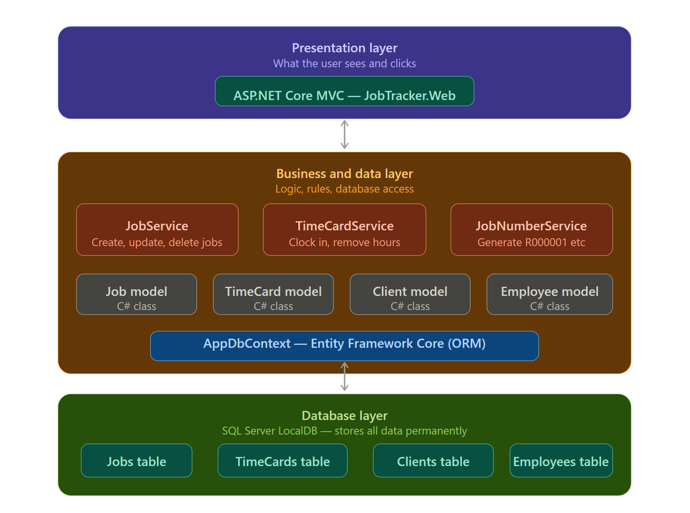

TIME SYSTEM — Job and Time Card Tracker
Built with .NET 10, ASP.NET Core MVC, Entity Framework Core

SCREENSHOTS
-----------

All Jobs Overview
-----------------

Create New Job
--------------

Edit Job
--------

Job Details and Time Cards
--------------------------

Clock In Hours
--------------

Solution Architecture
---------------------

ABOUT THIS PROJECT
------------------
This is a full-stack web application for tracking jobs and
employee time cards. It was built as a coding test to demonstrate
C# .NET development skills including OOP, ORM, and clean code
practices.

WHAT THE SYSTEM DOES
--------------------
- Create and manage jobs (Repair, Support, Warranty)
- Auto-generates job numbers (R000001, S000001, W000001)
- Log employee time cards against specific jobs
- View total hours worked per job
- Edit and delete jobs with confirmation page
- Remove incorrect time card entries

TECH STACK
----------
- Language      : C# / .NET 10
- Web Framework : ASP.NET Core MVC
- ORM           : Entity Framework Core 10
- Database      : SQL Server LocalDB
- UI Styling    : Bootstrap 5

SOLUTION STRUCTURE
------------------
The solution is split into 3 projects:

  JobTracker.Core
    - Model classes (Job, Client, Employee, TimeCard)
    - Enums (JobType: Repair, Support, Warranty)
    - Shared across all other projects

  JobTracker.Data
    - AppDbContext (EF Core database context + seed data)
    - Services (JobService, TimeCardService, JobNumberService)
    - Migrations (database version history)

  JobTracker.Web
    - Controllers (JobsController, TimeCardsController)
    - Views (Razor pages for all screens)
    - Program.cs (dependency injection setup)

DESIGN PATTERNS USED
--------------------
- Service Pattern     : Business logic lives in service classes
- Dependency Injection: Services injected via constructors
- Code First Migrations: Database managed through C# classes
- ORM                 : All database access via EF Core / LINQ

HOW TO RUN THIS PROJECT
-----------------------

REQUIREMENTS:
  - Visual Studio 2022
  - .NET 10 SDK
  - SQL Server LocalDB (installs automatically with Visual Studio)

STEPS:

  1. Clone the repository
     git clone https://github.com/EmirGonuler/JobTracker-Time-System.git

  2. Open the solution
     Open JobTracker.slnx in Visual Studio 2022

  3. Create the database
     Open Tools > NuGet Package Manager > Package Manager Console
     Run this command:

     Update-Database -Project JobTracker.Data -StartupProject JobTracker.Web

     This creates the database and loads sample data automatically.

  4. Run the application
     Set JobTracker.Web as the startup project
     Press F5

     The app will open in your browser.

SAMPLE DATA INCLUDED
--------------------
The database comes pre-loaded with:
  - 3 Clients   : Acme Corp, TechSolve, Deloitte
  - 3 Employees : Mike Johnson, Lisa Brown, Robin McGee
  - 3 Jobs      : R000001 (Repair), S000001 (Support), W000001 (Warranty)
  - 3 Time Cards: Hours logged against the sample jobs

FEATURES
--------
  - Create jobs with auto-generated job numbers
  - Three job types with colour-coded badges
  - Link jobs to clients
  - Log employee time cards with hours worked
  - View total hours per job
  - Edit and delete jobs with confirmation page
  - Remove incorrect time card entries
  - Success and error messages on all actions
  - Responsive Bootstrap UI

AUTHOR
------
Emir Gonuler
GitHub   : https://github.com/EmirGonuler

================================================================
